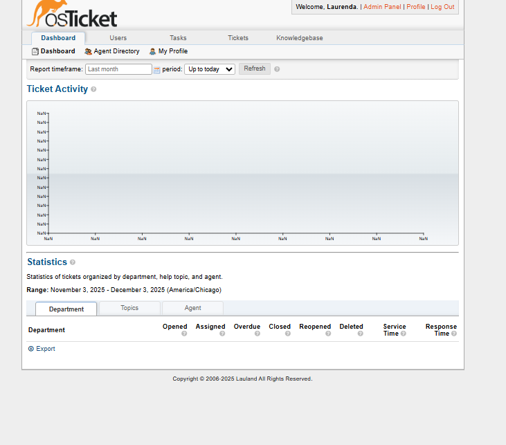

# Automated Help Desk Deployment (osTicket)


## 📖 About The Project

This project automates the deployment and configuration of **osTicket**, a widely-used open-source support ticket system. It demonstrates the use of **Bash scripting** for system administration tasks, including:
- LAMP Stack (Linux, Apache, MySQL, PHP) installation.
- Automated file permission management.
- Database creation and user privilege assignment.
- Application configuration.

This repository serves as a reference for deploying PHP-based applications on Ubuntu servers.

### 📸 Screenshots

**Admin Dashboard**

*A preview of the fully configured osTicket admin panel.*

**Automated Installation**

*The automated script handling dependencies and setup.*

---

## 🚀 Getting Started

### Prerequisites
- Ubuntu 20.04 or 22.04 LTS
- Sudo privileges

### Installation

1. **Clone the repository**
   ```bash
   git clone https://github.com/yourusername/automated-helpdesk.git
   cd automated-helpdesk
   ```

2. **Run the Installation Script**
   This script will update your system, install all dependencies, and download osTicket.
   ```bash
   chmod +x install.sh
   ./install.sh
   ```

3. **Configure the Database**
   Run the configuration script to set up the MySQL database and config files.
   ```bash
   chmod +x configure.sh
   ./configure.sh
   ```

4. **Finalize Setup**
   Open your browser and navigate to `http://localhost/upload` to complete the web-based setup wizard.

---

## 🛠️ Technologies Used
- **Scripting:** Bash
- **Web Server:** Apache2
- **Database:** MySQL
- **Language:** PHP
- **Application:** osTicket

## 📝 License
Distributed under the MIT License. See `LICENSE` for more information.
